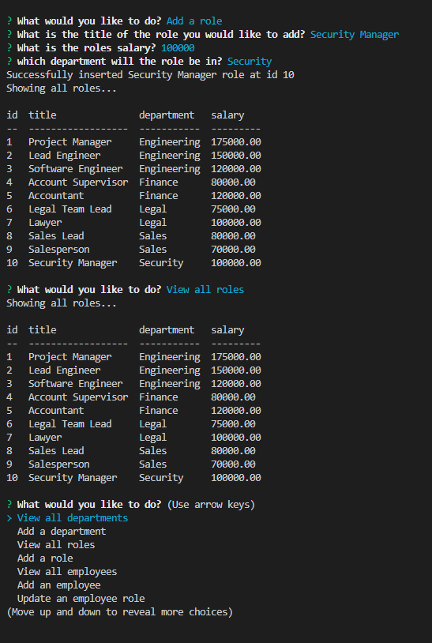

# Personal Portfolio

## Description

This application helps business owner keep track of their employees. 
I wanted to create an application which helps Business owners to manage database of their organisation this includes information of current departments, roles, salary, employees, managers etc. In addition to query the database they can also add new employees, departments and roles without having to quit the application. 

## Table of Contents 

If your README is long, add a table of contents to make it easy for users to find what they need.

- [Installation](#installation)
- [Usage](#usage)
- [Credits](#credits)
- [License](#license)
- [Features](#Features)
- [How to Contribute](#How_to_Contribute)

## Installation

User is required to clone the application from the [github](https://github.com/DancingSandwich/EmployeeTracker)

Once the application is cloned, please follow the steps below: 
- Run `npm i` to install packages
- Run `mysql -u root -p` from `db` folder using integrated terminal and enter your SQL password
- Run `SOURCE schema.sql;` and `SOURCE seeds.sql;` to create and populate business_db
- Run `node server.js` from newly created integrated terminal lanuched from server.js file

## Usage

Click on any of these links or images to view the projects and get in touch. 

## Credits

TBD

## License

MIT License

Copyright (c) [2022] [Sanket Panchal]

Permission is hereby granted, free of charge, to any person obtaining a copy
of this software and associated documentation files (the "Software"), to deal
in the Software without restriction, including without limitation the rights
to use, copy, modify, merge, publish, distribute, sublicense, and/or sell
copies of the Software, and to permit persons to whom the Software is
furnished to do so, subject to the following conditions:

The above copyright notice and this permission notice shall be included in all
copies or substantial portions of the Software.

THE SOFTWARE IS PROVIDED "AS IS", WITHOUT WARRANTY OF ANY KIND, EXPRESS OR
IMPLIED, INCLUDING BUT NOT LIMITED TO THE WARRANTIES OF MERCHANTABILITY,
FITNESS FOR A PARTICULAR PURPOSE AND NONINFRINGEMENT. IN NO EVENT SHALL THE
AUTHORS OR COPYRIGHT HOLDERS BE LIABLE FOR ANY CLAIM, DAMAGES OR OTHER
LIABILITY, WHETHER IN AN ACTION OF CONTRACT, TORT OR OTHERWISE, ARISING FROM,
OUT OF OR IN CONNECTION WITH THE SOFTWARE OR THE USE OR OTHER DEALINGS IN THE
SOFTWARE.

---

## Features

Once application is has launched user is presented with lit of choices necessary to perform fetures shown below.
- View all Departments
- Add a department
- View all roles
- Add a role
- View all employees
- Add an employee
- Update an employee role
- Exit the Employee Tracker

## How to Contribute

Create a seperate feature branch and create pull request. 